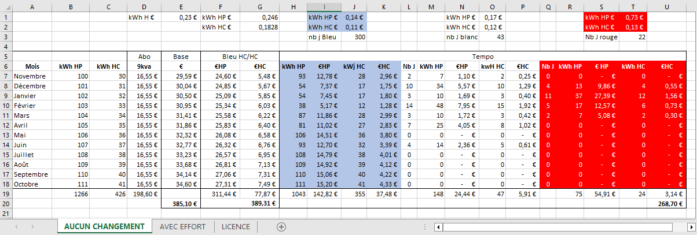

# bleu_tempo_simulator
Feuille de calcul Excel permettant de faire une estimation mensuelle de la facture électrique en tarif Bleu avec option Tempo à partir de votre consommation électrique des 12 derniers mois. 
__Avertissement :__ cette feuille permet de faire une estimation sans aucune garantie. Il ne s'agit en aucun cas d'un engagement contractuel. Vous restez pleinement responsable de l'usage que vous en faites !

Cette feuille de calcul est distribuée sous la licence [GNU GPL v3 ](LICENSE)

# Le tarif Bleu Tempo
__Le tarif Bleu option Tempo__ ( [site web EDF](https://particulier.edf.fr/fr/accueil/gestion-contrat/options/tempo/details.html) ) permet d'obtenir des réductions de prix significatives sur le kWh électrique les jours où la demande n'est pas forte (300 jours bleus par an), moyennement forte (43 jours blancs). Les jours à forte demande électrique (22 jours rouges), au contraire, vous paierez le kWh HP beaucoup plus cher (à date - non contractuel : environ 3fois plus cher).

# Principe de fonctionnement 
A partir de vos données de consommation électrique mensuelle (HC/HP), la feuille de calcul vous permettra d'estimer le gain/surcout de basculer vers Tempo.
La prise en compte des jours bleu/blanc/rouge est basé sur le calendier EDF Tempo (du 1er  novembre 2022 au 17 Octobre 2023). 
La répartition de la consommation entre jour Bleu/Blanc/Rouge se fait au prorata temporis (consommation mensuelle HP/HC divisé par le nb de jours concernés).

## Vos données : 
Récupérez sur le site de votre fournisseur d'énergie les données de votre consommation électrique mensuelle en kWh (Heure Pleine HP, et éventuellement Heure Creuse)

## La feuille de calcul :
Téléchargez la feuille de calcul Excel [bleu_tempo_simulator.xlsx](./bleu_tempo_simulator.xlsx) sur votre ordinateur. 
Ouvrez la avec votre tableur préféré (qui doit supporter le format de fichier .XLSX).

### Les onglets : 
* __AUCUN CHANGEMENT__ : Onglet principal dans lequel vous saisirez vos données.  
Vous pourrez aussi consulter l'estimation de la facture avec l'option Tempo sur une base de consommation identique (= vous n'avez fait aucune effort de reduction de consommation sur les jours blanc/rouge)

* __AVEC EFFORT__ : reprise du tableau précédent mais vous pouvez préciser l'effort de reduction de consommation sur les jours blanc/rouge.

* __LICENCE__ : La licence GNU GPL v3

# Utilisation

## Configuration et personnalisation :
### Onglet 'AUCUN CHANGEMENT' :
Les valeurs des cellules suivantes peuvent être modifiées : 

* __B7 à B18__ : votre consommation mensuelle HP 
* __C7 à C18__ : Votre consommation mensuelle HC. Si vous n'avez pas l'option HC/HP, faites une estimation de ce que vous consommeriez en heure creuse, ou mettez les cellules à zéro (0).
* __D7 à D18__ : montant de votre abonnement mensuel

__Facultatif__ (valeurs à la date du 17/10/2023 ):
Prix du kWh en € :
* __E1__ : tarif de base  (pas d'HP/HC)
* __G1__ : HP en tarif option HP/HC
* __G2__ : HC en tarif option HP/HC
* __J1__ : HP Tempo jour Bleu
* __J2__ : HC Tempo jour Bleu
* __O1__ : HP Tempo jour BLANC
* __O2__ : HC Tempo jour BLANC
* __T1__ : HP Tempo jour ROUGE
* __T2__ : HC Tempo jour ROUGE

Répartition des jours Bleu/Blanc/Rouge :
* __L7 à L18__ : nb de jours Blanc par mois
* __Q7 à Q18__ : nb de jours Rouge  par mois

### Onglet 'AVEC EFFORT' :

Les valeurs des cellules suivantes peuvent être modifiées pour préciser la limitation de consommation que vous voulez simuler.

_Par exemple, un 80% indique qu'au lieu de consommer 100kWh vous penser pouvoir limiter votre consommation à 80kWh._

* __N2__ : % sur HP jour Blanc
* __P2__ : % sur HC jour Blanc
* __R2__ : % sur HP jour Rouge
* __P2__ : % sur HC jour Rouge

Toutes les autres données (consommation, prix kwH, nb jour tempo) sont reprises automatiquement de l'onglet 'AUCUN CHANGEMENT'

## Resultat :
### Onglet AUCUN CHANGEMENT :
* __E20__ : cout estimatif annuel en tarif plein
* __G20__ : cout estimatif annuel en tarif HP/HC
* __U20__ : cout estimatif annuel en tarif Tempo

### Onglet AVEC EFFORT :
* __U20__ : cout estimatif annuel en tarif Tempo avec  effort sur les jours blanc et rouge.
